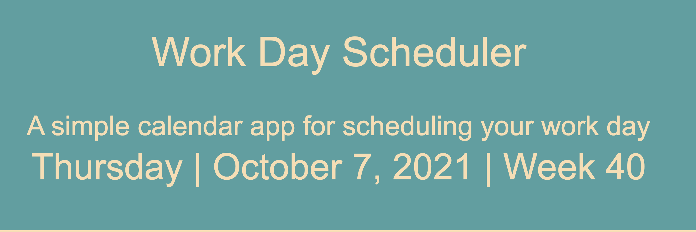
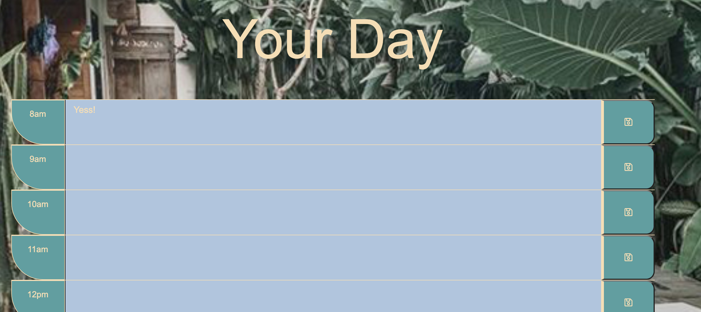

# Third Party APIs

## About this assignment

The assignment was to  a simple calendar application that allows a user to save events for each hour of the day by modifying starter code. The app runs in the browser and feature dynamically updated HTML and CSS powered by jQuery. It also uses the Moment.js library to work the date and time.

### The app has the following features:
1. When you open the Work Day Schedule, the current day is displayed at the top of the calendar.
2. When you scroll down you are presented with timeblocks for standard business hours.
3. Each timeblock is color coded to indicate whether it is in the past, present, or future.
4. When you click into a timeblock you can enter an event.
5. When you click the save button for that timeblock the text for that event is saved in local storage.
6. If you refresh the page the saved events persists.

### Obstacles to overcome

There were two features that stumped me for a while. I watched a lot of Youtube videos and asked for some help, eventually I got everything working correctly. 
The first was ensuring that the timeblock entries saved to local storage and persisted when the browser was refreshed. The second was the conditions for the timeblock color coding.

### This application has been deployed at a live URL which you can see here: 
https://marcmalliate.github.io/Third-Party-APIs/

### You may also like to view the GitHub repository which contains the code repository: 
https://github.com/marcmalliate/Third-Party-APIs

### Screenshots of application:

Here are two screenshots of the app

© 2021 Marc Malliate# Third-Party-APIs